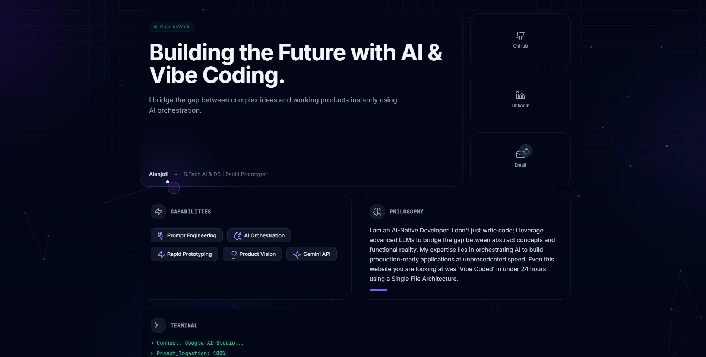

# ⚡ Alenjofi | AI-Native Developer

> *Bridging the gap between complex AI models and intuitive user interfaces.*

[-orange?style=for-the-badge)](https://en.wikipedia.org/wiki/Single-page_application)

## 🌐 [**View Live Experience**](https://alenjofi.github.io/)

---

## 🧬 The Paradigm: Vibe Coding & SFA

I am a **1st-Year B.Tech AI & DS Student** redefining software development. 

This project challenges the bloat of modern web engineering. It is architected using a **Single File Architecture (SFA)**:
* **0** Build Steps
* **0** `node_modules`
* **0** Bundlers (Webpack/Vite)
* **1** Optimized File (`index.html`)

### The Workflow
I act as the **Systems Architect** and **Product Visionary**, leveraging **Google Gemini 1.5 Flash** as the execution engine. This "Vibe Coding" workflow allows me to bypass syntax drudgery and focus purely on **User Experience, Logic Flow, and System Design**, shipping production-ready applications in hours, not weeks.

## 🧠 Core Capabilities

| Feature | Description |
| :--- | :--- |
| **Adaptive Bento Grid** | A responsive, glass-morphism UI that reflows gracefully from mobile touchscreens to ultra-wide 4K monitors. |
| **Physics Engine** | Custom `requestAnimationFrame` loops creating a magnetic cursor with linear interpolation (Lerp) for fluid motion. |
| **Spotlight UX** | Real-time `mousemove` event tracking injects CSS variables to create dynamic border glows and lighting effects. |
| **Live Terminal** | A simulated boot sequence representing the handshake between the user and the AI model. |

## 🕹️ The "God Mode" Easter Egg

Hidden within the code is a complete visual overhaul inspired by retro-cyberpunk aesthetics. This serves as a live demonstration of **Global State Management** without external libraries.

**Trigger Protocol:**
1.  **The Shortcut:** Click the small **Gamepad Icon (🎮)** in the footer.
2.  **The Classic:** Type the Konami Code: `↑ ↑ ↓ ↓ ← → ← → B A`

**System Override Effects:**
* ✅ Global CSS Variable Injection (`--matrix-green`)
* ✅ Canvas Particle System Re-initialization
* ✅ CRT Scanline Overlay Activation
* ✅ Terminal "Superuser" Access Granted

## 🛠️ Technical Stack

This portfolio runs on the **"CDN Stack"** for maximum portability and zero server costs.

* **Runtime:** Browser Native (ES6+)
* **Core Library:** React 18 & ReactDOM 18 (via UMD)
* **Transpiler:** Babel Standalone (In-browser compilation)
* **Styling:** Tailwind CSS (via CDN script)
* **Assets:** Lucide-React (SVG Components)

## 🌟 Featured SaaS: Fine Print Breaker

This portfolio serves as the launchpad for my flagship tool, **[Fine Print Breaker](https://alenjofi.github.io/contract-audit/)**.

* **Mission:** AI-powered legal contract auditor for freelancers.
* **The Solver:** Features a **"Fix Clause"** agent that rewrites predatory legal terms into fair language instantly.
* **Architecture:** 100% Client-Side Privacy using Gemini API.

---

### 📬 Connect With Me

I am actively looking for internships where I can apply **AI Orchestration** to build shipping products fast.

* **LinkedIn:** [Alen Jofi](https://www.linkedin.com/in/alen-jofi-119bab375)
* **GitHub:** [@alenjofi](https://github.com/alenjofi)
* **Email:** alenjofi66@gmail.com

*© 2025 Alenjofi. Architected with Vision, Built by Gemini. (Zero manual lines written).*
